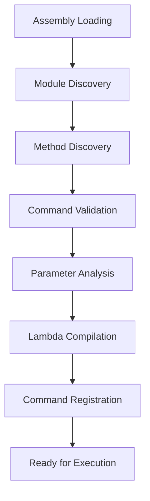

# Command Creation Pipeline in Jiro.Commands

## Overview

The Jiro.Commands framework implements a sophisticated command creation pipeline that automatically discovers, analyzes, and registers command methods from assemblies. This pipeline transforms decorated methods into executable command objects through a series of well-defined stages.

## Pipeline Architecture

The command creation pipeline consists of the following sequential stages:



Each stage processes the output of the previous one, transforming assemblies into executable command objects ready for runtime execution.

## Stage 1: Assembly Discovery

### Assembly Loading Process

The pipeline begins by discovering all loaded assemblies in the current application domain:

```csharp
internal static Assembly[]? GetDomainAssemblies() => AppDomain.CurrentDomain.GetAssemblies();
```

**Key Characteristics**:

- Scans all assemblies currently loaded in the AppDomain
- Includes both application assemblies and referenced libraries
- Dynamic assemblies are included if loaded at runtime
- No file system scanning - only in-memory assemblies

### Assembly Filtering

The system processes assemblies that contain:

- Types decorated with `[CommandModule]`
- Public or internal accessibility
- Non-interface, non-abstract classes

## Stage 2: Command Module Discovery

### Module Identification

Command modules are identified using the `CommandModuleAttribute`:

```csharp
internal static Type[]? GetCommandModules(Assembly[] assemblies)
{
    var commandModules = assemblies
        .SelectMany(asm => asm.GetTypes()
            .Where(type =>
                !type.IsInterface
                && type.GetCustomAttributes(typeof(CommandModuleAttribute), false).Length > 0
        ))
        .ToArray();

    return commandModules;
}
```

### Module Requirements

Valid command modules must:

- Be concrete classes (not interfaces or abstract)
- Have the `[CommandModule]` attribute
- Be instantiable through dependency injection
- Inherit from or implement `ICommandBase`

### Example Command Module

```csharp
[CommandModule]
public class WeatherController : BaseController
{
    [Command("weather", CommandType.Text, Description = "Get weather information")]
    public async Task<ICommandResult> GetWeatherAsync(string location)
    {
        // Command implementation
        return new TextResult($"Weather in {location}: Sunny, 25°C");
    }
}
```

## Stage 3: Method Discovery

### Command Method Identification

Within each module, the pipeline identifies command methods:

```csharp
internal static MethodInfo[] GetPotentialCommands(Type type)
{
    var methodInfos = type
        .GetMethods()
        .Where(method => method.GetCustomAttributes(typeof(CommandAttribute), false).Length > 0)
        .ToArray();

    return methodInfos;
}
```

### Method Criteria

Valid command methods must:

- Have the `[Command]` attribute
- Be public or internal
- Have a supported return type
- Accept supported parameter types

### Supported Return Types

- `void` - Fire-and-forget commands
- `Task` - Async commands without return value
- `Task<T>` - Async commands with return value
- `ICommandResult` - Structured command results
- `Task<ICommandResult>` - Async structured results

## Stage 4: Command Validation

### Attribute Analysis

Each command method is analyzed for its attributes:

```csharp
var commandName = method.GetCustomAttribute<CommandAttribute>()?.CommandName.ToLower() ?? "";
var commandType = method.GetCustomAttribute<CommandAttribute>()?.CommandType ?? CommandType.Text;
var commandDescription = method.GetCustomAttribute<CommandAttribute>()?.CommandDescription ?? "";
var commandSyntax = method.GetCustomAttribute<CommandAttribute>()?.CommandSyntax ?? "";
```

### Validation Rules

1. **Unique Names**: Command names must be unique within the application
2. **Valid Types**: Command types must be from the `CommandType` enumeration
3. **Parameter Compatibility**: All parameters must have compatible type parsers
4. **Return Type Validation**: Return types must be supported by the framework

### Async Detection

The pipeline automatically detects asynchronous methods:

```csharp
var isAsync = method.ReturnType == typeof(Task) ||
              (method.ReturnType.IsGenericType && 
               method.ReturnType.GetGenericTypeDefinition() == typeof(Task<>));
```

## Stage 5: Parameter Analysis

### Parameter Discovery

For each command method, the pipeline analyzes its parameters:

```csharp
internal static IReadOnlyList<ParameterInfo> GetParameters(MethodInfo methodInfo)
{
    List<ParameterInfo> parameterInfos = new();
    var parameters = methodInfo.GetParameters();

    foreach (var parameter in parameters)
    {
        ParameterInfo parameterInfo = new(
            parameter.ParameterType, 
            GetParser(parameter.ParameterType)!
        );
        parameterInfos.Add(parameterInfo);
    }

    return parameterInfos;
}
```

### Type Parser Assignment

Each parameter type is assigned a compatible type parser:

```csharp
private static TypeParser? GetParser(Type type)
{
    return type switch
    {
        _ => (TypeParser)Activator.CreateInstance(
            typeof(DefaultValueParser<>).MakeGenericType(new Type[] { type })
        )!
    };
}
```

### Supported Parameter Types

- **Primitive Types**: `int`, `string`, `bool`, `double`, etc.
- **Complex Types**: Custom classes with appropriate parsers
- **Collections**: Arrays and lists with element type parsers
- **Nullable Types**: Optional parameters with null handling

## Stage 6: Lambda Compilation

### Compilation Process

The most critical stage involves compiling method invocation lambdas:

```csharp
var compiledMethod = CompileMethodInvoker<TBaseInstance, TReturn>(method);
```

**Benefits**:

- **Performance**: 20x faster than reflection
- **Type Safety**: Compile-time type checking
- **Memory Efficiency**: Zero allocations per call

### Wrapper Creation

A uniform async wrapper is created for all commands:

```csharp
Func<ICommandBase, object?[], Task> descriptor = async (instance, args) =>
{
    var result = compiledMethod((TBaseInstance)(object)instance, args ?? Array.Empty<object?>());
    if (result is Task task)
        await task;
    else if (result is not null)
        await Task.FromResult(result);
};
```

## Stage 7: Command Registration

### CommandInfo Creation

The final command object is created:

```csharp
CommandInfo commandInfo = new(
    commandName,
    commandType,
    isAsync,
    declaringType,
    descriptor,
    args,
    commandSyntax,
    commandDescription
);
```

### Registration Storage

Commands are stored in a registry for runtime lookup:

- **Name-based indexing** for O(1) command lookup
- **Type-based grouping** for category queries
- **Metadata caching** for help system integration

## Pipeline Configuration

### Customization Points

The pipeline can be customized at several points:

1. **Assembly Filtering**: Custom assembly discovery logic
2. **Module Filtering**: Additional module validation rules
3. **Method Filtering**: Custom method selection criteria
4. **Type Parsers**: Custom parameter type handling
5. **Result Handlers**: Custom return type processing

### Performance Considerations

- **Lazy Loading**: Commands compiled on first use
- **Caching**: Compiled delegates cached indefinitely
- **Memory Usage**: Scales with number of command methods
- **Startup Time**: Initial compilation may impact cold start

## Error Handling

### Common Errors

1. **Compilation Failures**:

   ```csharp
   throw new InvalidOperationException(
       $"Failed to compile method invoker for {method.Name}: {ex.Message}", ex
   );
   ```

2. **Type Parser Missing**:
   - Fallback to `DefaultValueParser<T>`
   - Runtime error if conversion fails

3. **Duplicate Command Names**:
   - Last registered command wins
   - Warning logged for duplicates

### Debugging Support

- **Verbose Logging**: Detailed pipeline execution logs
- **Error Context**: Full method and type information
- **Reflection Fallback**: Option to disable compilation for debugging

## Best Practices

### Module Design

```csharp
[CommandModule]
public class MyCommands : BaseController
{
    // Group related commands in single modules
    // Use descriptive command names
    // Provide comprehensive help text
    
    [Command("example", CommandType.Text, 
             Description = "Example command",
             Syntax = "example <parameter>")]
    public async Task<ICommandResult> ExampleAsync(string parameter)
    {
        // Implementation
    }
}
```

### Performance Optimization

1. **Minimize Parameter Count**: Fewer parameters = faster compilation
2. **Use Primitive Types**: Built-in parsers are more efficient
3. **Avoid Complex Inheritance**: Simple hierarchies compile faster
4. **Cache Results**: Store expensive computation results

### Testing Strategy

```csharp
[Test]
public void Command_ShouldBeDiscovered()
{
    // Test command discovery
    var modules = ReflectionUtilities.GetCommandModules(assemblies);
    Assert.That(modules, Contains.Item(typeof(MyCommands)));
}

[Test]
public void CommandMethod_ShouldCompile()
{
    // Test compilation
    var method = typeof(MyCommands).GetMethod("ExampleAsync");
    var compiled = ReflectionUtilities.CompileMethodInvoker<MyCommands, Task>(method);
    Assert.That(compiled, Is.Not.Null);
}
```

## Monitoring and Diagnostics

### Pipeline Metrics

- **Discovery Time**: Time to discover all commands
- **Compilation Time**: Time to compile all delegates
- **Memory Usage**: Memory consumed by compiled delegates
- **Error Rate**: Percentage of failed compilations

### Diagnostic Tools

```csharp
public static class CommandDiagnostics
{
    public static int TotalCommands { get; }
    public static int CompiledCommands { get; }
    public static TimeSpan CompilationTime { get; }
    public static IReadOnlyList<string> Errors { get; }
}
```

## Future Enhancements

### Planned Improvements

1. **Source Generators**: Compile-time command discovery
2. **Hot Reload**: Runtime command updates without restart
3. **Plugin Architecture**: Dynamic command loading/unloading
4. **Advanced Caching**: Persistent delegate caching
5. **Performance Analytics**: Built-in performance monitoring

### Extensibility Points

- **Custom Attributes**: Additional command metadata
- **Middleware Pipeline**: Command execution interceptors
- **Result Transformers**: Custom result processing
- **Security Filters**: Permission-based command filtering

## Conclusion

The command creation pipeline in Jiro.Commands provides a robust, high-performance foundation for building command-driven applications. By leveraging reflection, expression trees, and compiled delegates, it achieves the flexibility of dynamic discovery with the performance of static compilation.

The pipeline's modular design allows for extensive customization while maintaining sensible defaults for common scenarios. Understanding this pipeline is crucial for effectively using and extending the Jiro.Commands framework.
